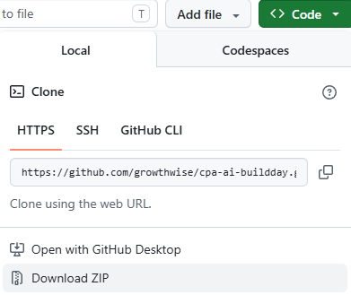

# CPA AI Build Day - Stream A

Welcome to Stream A! Stream A is for you if you're using AI but want to know extend your knowledge and capabilties of the systems. 

We like to refer to it as "moving beyond communication" we will be looking at using AI (Claude in particular) for actually completing tasks for us, not just for rewriting emails. 

## Setup Requirements 

To get the most from the day we recommend you have the following setup:

- A paid claude account (You will need a Pro account or above)
- Claude Desktop App Installed (https://code.claude.com/docs/en/desktop-quickstart)
- Have downloaded everything from [The Github Respository](#resources)

_The activities we are doing are system agnostic, they should work if you are using Windows, or if you are using a Mac_

_Whilst the Focus today is for Claude Cowork many of the exercises will also work in OpenAI Codex_

## Resources

The aim of today is to learn to build with AI tools
The resources for each session can be found in the [Resources](./resources) folder

You can also download all current resources from this page by clicking on "Code" and "Download Zip"

We recommend doing the method above as it will capture absolutely everything that you need for today

This page and the resources will remain live even after the build day, so if you don't get through everything don't be concerned - you will have more time to continue trying and learning.

## Today's Schedule 

The schedule for stream A can be found [here](STREAM_A_SCHEDULE.MD) the schedule contains links to readme files for each session where applicable, so best to go there to follow along throughout the day. 

This page will remain active even after today, so if you feel like you couldn't complete an exercise you can come back to the resources here to continue learning!

### Your Presenters for the day

- Heather Smith (https://www.linkedin.com/in/heathersmithau/)
- Natalie Lennon (https://www.linkedin.com/in/natalielennon/)
- Beau Gaudron (https://www.linkedin.com/in/beaugaudron/)

