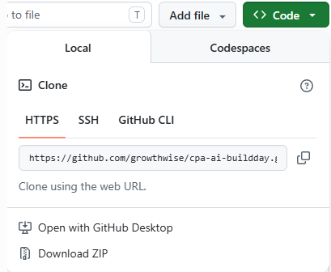
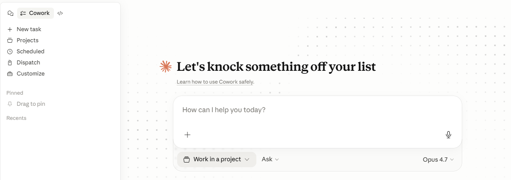
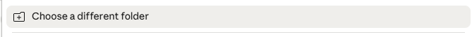
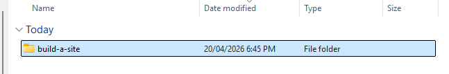
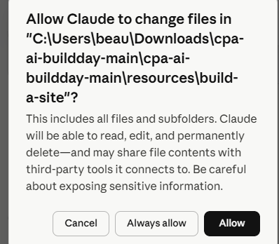
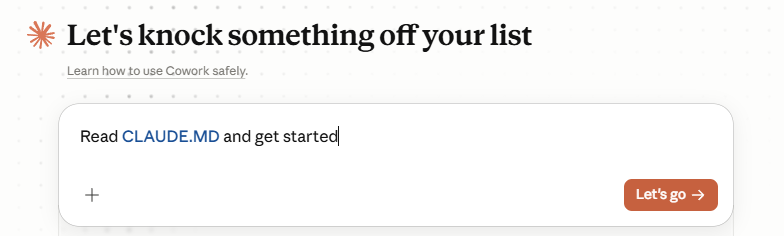
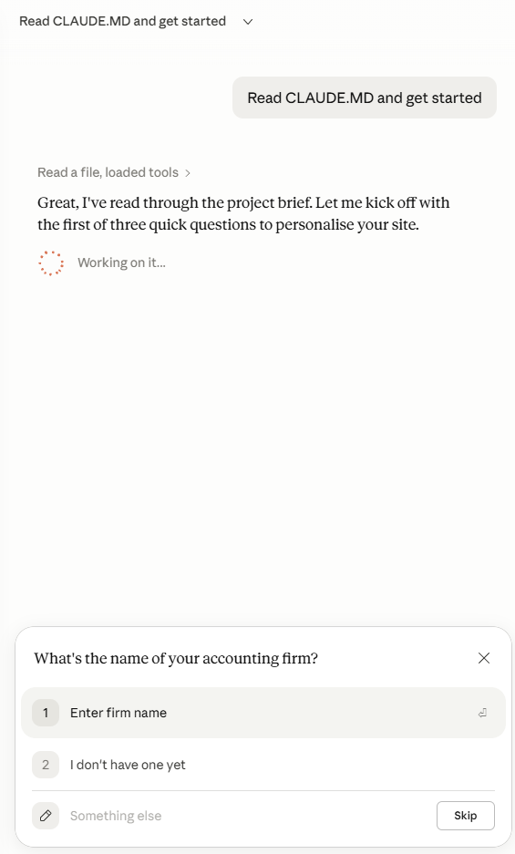

# Example Site Builder using CLAUDE.MD in Cowork #

We've put this together so you can quickly see a build example. Follow the instructions to try for yourself.

The instructions below are for Claude Cowork, however if you are using OpenAI Codex you can just specify the folder as your project, it will import CLAUDE.MD as AGENTS.MD and you can then type

```Read Agents.MD and get started```

Otherwise, all Claude instructions are below :-) 

### Downloading Files ###

Good news, if you downloaded the set of files earlier you already have everything you need.

If you haven't head to here https://github.com/growthwise/cpa-ai-buildday

Then click on code and "Download zip"



Unzip the file once you've downloaded it

### Now In Claude Cowork ###

Open the Claude app and click the "Cowork" 

Click " Work in a Project" and "Work In a Different Folder"





Within the resources folder, select build-a-site



Click allow to allow folder access



### Start with a prompt ###

Type this prompt "Read CLAUDE.MD and get started" then click "Lets Go"



You will be guided through the rest of the build :-) Remember to answer the questions at the bottom of the window. 



At the end of the build, you should have a basic website generated for you to review. 


