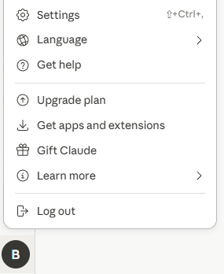
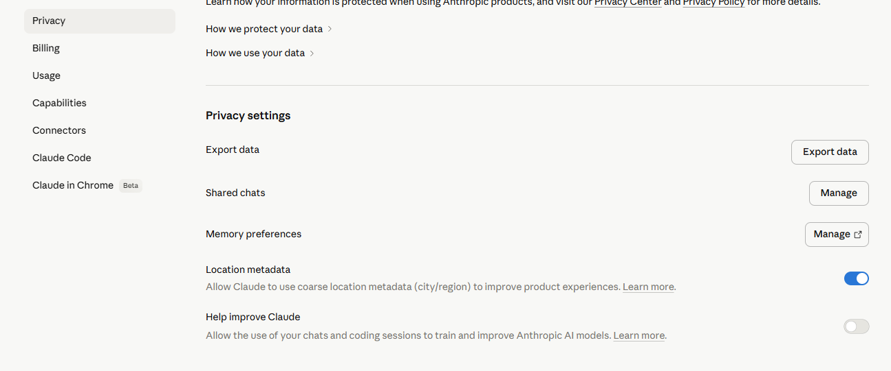

# Data Considerations #

Use of data with AI tools is always, and should always be a paramount consideration for anyone - but it can also be the reason why people never "start" on an AI journey. In this session we'll explore techniques of using dummy data to learn, de-identifying/obfuscating data and finally data agreements. 

## Using Demo Data 

The quickest approach for getting started is just using data that exists that is designed to be used for demonstration purposes. 

For example

- Xero Demo Organisation: several reports, with data are available from within this account. Make sure you've "reset" the account and then any report you download here you can use in an LLM to learn how to interact with it. 
- Free Training Data for Example Jason Staat's [Fake Docs](https://drive.google.com/drive/folders/1bVm4_PMNm7aE6l7HC1WZqyB4Ti2jEdXZ)

- Make your own data: Another technique is to use one row of data, and ask an LLM to create dummy records. For example [this](/data_session/files/fyi_example.csv>raw=true) is one record from an FYI job export. We can use it to generate thousands of records

Upload it to Claude and prompt

``` Create 1000 records that follow this pattern, also add in 4 other categories financials, bookkeeping, smsf, advisory ```

At this level, you're just using the data to make sure your ambitions with it can be met, without giving up anything confidential. 

## Beyond Demo Data 

Once you're comfortable with demo data, you'll likely want to move onto real data for real tasks. For this the best things to consider are:

- What output do I need?
- To get that output what inputs are required?
- Do my inputs contain PII or other Identifying data?

From here sometimes simple things can be effective enough e.g. what if your system just uses a client code thats numeric as an identifier you may be able to delete the other identifying columns because the code enough still allows for your output

If it doesn't though you can create coded data from your existing data, that you can use a "key" or "mapping table" to unlock when your LLM has responded. 

For an example of this see [Karbon Timesheet Spreadhseet](files/karbon_timesheets_spreadsheet.xlsx) we have created a mapping table for team member.

We then removed anything identifying as all we want to see is a dashboard of where time is spent, other data becomes irrelevant see [Karbon Timesheet CSV](resources/data_session/files/karbon_example.csv?raw=true)

Once you have the CSV, upload into Cowork or Claude Chat and prompt 

``` Create a dashboard using this data that shows me where each team member spends their time, a visual graph and consolidated table will work ```

_Some data types will require more work than others e.g. PDF's are not easily obfuscated_

Remember as well sometimes data is exposed in more than one place, for example if you have the ability to extract data from an API, maybe it has a different data shape that requires less work to obfuscate. 

If this is still limiting to you, the next step would be to look at creating your own tools using Format Preserving Encryption that can be used on several files, but is a much more technical process.  

## Account Types

Certain account types do offer levels of data protection, once you're comfortable with your workflows you may want to consider upgrading to commercial type accounts, but keep in mind that you still need to follow relevant legislation, and recommendations provided by your industry bodies. 

## Data Agreements & Gotcha's

Remember that many tools, even some paid accounts may have training enabled by default. 

For Claude, to check this click on your name icon in the bottom left of the chat or app then click settings



Click on Privacy in the left menu and then untick "Help Improve Claude"



Its important to remember though, turning this off does not make everything private, certain data is still sent to allow the application to operate. 

### Retention Policies

Most AI tools will normally have a data retention policy. Be aware of the retention period.

If you absolutely can not risk retention at all you will need to consider providers that offer ZDR (Zero Data Retention) 

### Gotcha's

Always read the terms and conditions and make sure it aligns to your internal policies.

A paid account does not always mean a private accounts, nor does it mean no training.  


