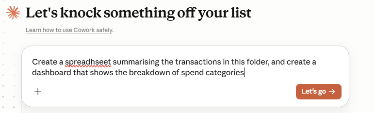
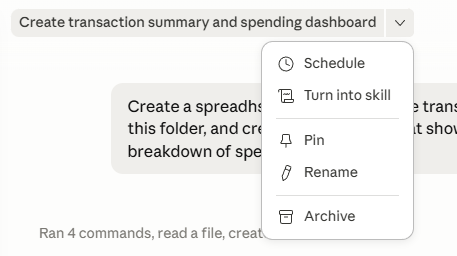
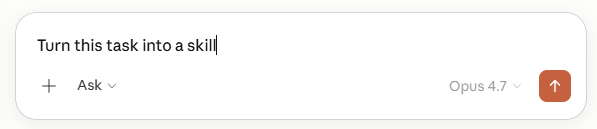
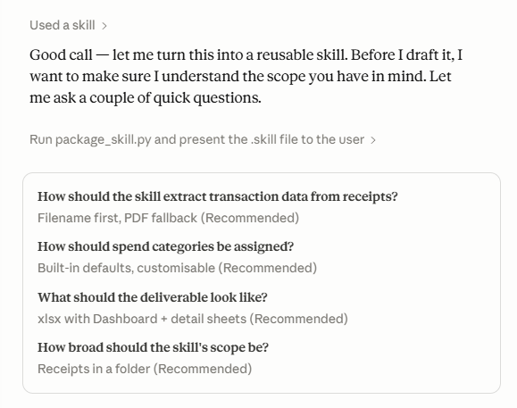
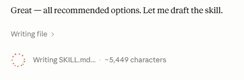
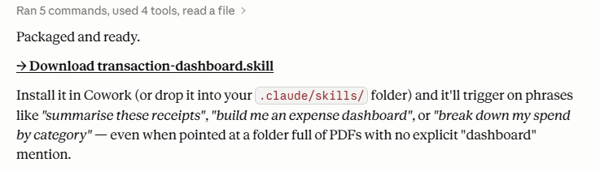
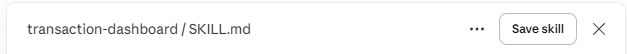

# Building in Cowork Example (Simple Technique) #

Before getting started here first we need to consider a few things

1. What does Cowork need to see to achieve the task (Folder)
2. What do you want it to do with the data you provide it? (Action)
3. What do you want the output to look like, or be used for (e.g A spreadsheet, an accounting file import)

We're going to use some dummy data for this. 

Go to this site https://drive.google.com/drive/folders/11-miY1tK7kxk4J4_xXWRu0iel-0aiYJa and download the folder. This is all dummy data provided
by our friend @Jason Staats

Unzip the file.

In Cowork, chose the folder you just unzipped

Now lets prompt 

"Create a spreadhseet summarising the transactions in this folder, and create a dashboard that shows the breakdown of spend categories"

Click Let's Go

Let cowork do the work...

Don't be afraid to continue prompting it if you want to expand on this further

# Make It Re-usable #

If the task you are getting Cowork to complete is something you do often once Cowork's produced an output you can turn it into a skill. 

Hover over the title at the top of cowork, click the drop down and click on "Turn Into Skill" or just type "Turn This Task into a Skill" and press the arrow button to start

## Skill Creation ##

You will see Cowork start skill creation and it may ask you some clarifying questions and eample of this is below

Cowork will put together the instructions and will create a SKILL.MD file, this may take some time. You can do other tasks whilst Cowork completes its work. 

Once completed you can download the skill for reuse

Upon clicking download, in the top right of the window that pops up click on "Save Skill"

This makes the skill re-usable based on trigger words that you will see in the skill window. 

## What About Building Something Else? ##

We have an example using a pre-defined build file that you can try [here](../resources/build-a-site) 

This uses a [CLAUDE.MD](../resources/build-a-site/CLAUDE.MD) file with definitions on what to do, instead of requiring prompting. 

