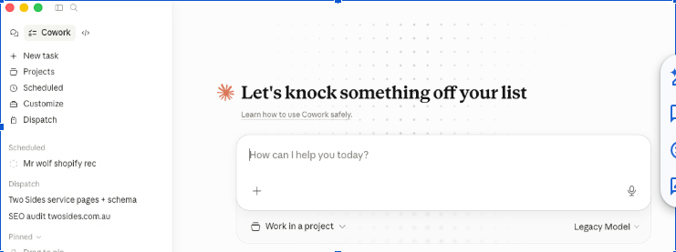
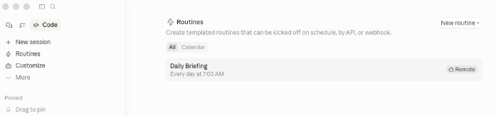
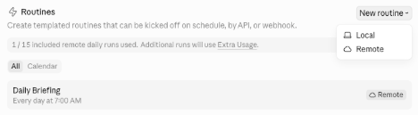
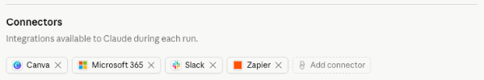

In this session we will be discussing real accounting use cases

We will populate the examples given post session completion.

### Daily Routine Setup Using Claude (Nat)

In Claude click on "Code" the one that looks like </>




Click on Routines, then "New Routine"



Choose "Remote" this allows your routine to run without your machine having to be on, an advantage over just using "schedule"



You now need to set a name and describe what it needs to do. Nat's prompt for the routine is

``` Check my calendar for meetings for the day and my email inbox and provide a brief for the day. Send the briefing to the #dailybrief Slack channel ```

Select a repository, for this you will need a free [Github](www.github.com) account, this allows claude to save data as it runs in the cloud. 

Set your schedule for when you want this to run

Ensure you connect your systems that are relevant to the brief



### Testing

Run a test of the new routine now to ensure it works as expected

# Role Play

**Prompt:** I'd like you to help me practise a difficult conversation. I'm the Tax Agent, and you represent the client, who is a plumber. I, the Tax Agent, need to tell YOU the client that you cannot claim the trip to Italy through the business. You heard from a friend at the pub that you were able to do this.

*\<wait for Claude to respond\>*

---

**Prompt:** Hello. Your trip to Italy sounds fabulous, however you are not able to claim the trip to Italy as a business expense.

*\<wait for Claude to respond\>*

---

**Prompt:** Did you attend any conferences or have any meetings with anyone related to your business?

*\<wait for Claude to respond\>*

---

**Prompt:** That's great you got to see different plumbing setups! However, for the trip to be a deductible business expense, the ATO requires a stronger business purpose, like attending a formal event, conference, or having set meetings with industry contacts. Observing setups informally doesn't meet the requirements, so unfortunately, it won't qualify for a business claim.

---

# Pub Trivia

In 1950 Alan Turing published his work *"Computing Machinery and Intelligence"* which eventually became The Turing Test, which experts used to measure computer intelligence. This is when the term "artificial intelligence" came into popular use. His life is portrayed by Benedict Cumberbatch in *The Imitation Game* (2014).
